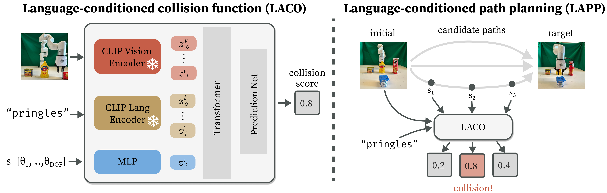

# Language-Conditioned Path Planning
Official implementation of [Language-Conditioned Path Planning](https://arxiv.org/abs/2308.16893), published in CoRL 2023.

\[[Paper](https://arxiv.org/abs/2308.16893)\] \[[Website](https://amberxie88.github.io/lapp/)\] \[[Video](https://youtu.be/YWJDhd3PXHU)\]

## Method


## Data Collection
```
python3 data_collection.py n_data=NUM_DATA save_folder=PATH/TO/SAVE save_viz=False save_prefix=PREFIX
```

If running headless, you may find VGL helpful (`vglrun -d :0.0 `).

To collect real-world data (for sim2real training), modify the `sim_xarm.ttt` scene, change randomization parameters, and set `env=real_ycb`.


## Training LACO
To train LACO, a language-conditioned collision function, on your dataset:
```
python3 -u train_laco.py n_epochs=N_EPOCHS experiment_folder=FOLDER experiment_name=EXPERIMENT device=0 folder=PATH/TO/TRAIN eval_folder=PATH/TO/EVAL
``` 

## Training Multi-View MAE
```
python3 -u train_mv.py experiment_folder=FOLDER experiment_name=EXPERIMENT device=7 folder=PATH/TO/TRAIN eval_folder=PATH/TO/EVAL
```

Visualizations of the reconstructions are available in the plot folder!

## Installation
First, create your conda environment:

```
conda env create -f env.yml
```

Then, install [PyRep](https://github.com/stepjam/PyRep) and [RLBench](https://github.com/stepjam/RLBench).

You will also need to download the [ShapeNetCore-v2](https://shapenet.org/) dataset and update the paths accordingly in `utils.py`. To train with YCB objects, you should also download the appropriate objects and set the paths accordingly in `utils.py`.

## Citation
```
@inproceedings{
        xie2023languageconditioned,
        title={Language-Conditioned Path Planning},
        author={Amber Xie and Youngwoon Lee and Pieter Abbeel and Stephen James},
        booktitle={7th Annual Conference on Robot Learning},
        year={2023},
        url={https://openreview.net/forum?id=9bK38pUBzU}
}
```